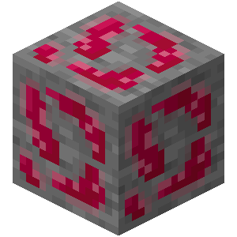
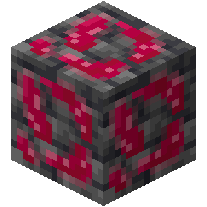

# Erythrite

Erythrite is a mineral used to craft organ blocks.

{width=64, height=64}

## Obtaining

### Mining

{width=100, height=100} {width=100, height=100}

Erythrite ores can be mined with stone pickaxes or better. Breaking erythrite ores drops 2-3 erythrite, unless mined with a Silk Touch pickaxe, in which case it drops itself. It is affected by Fortune.

### Smelting

Erythrite can be obtained by smelting erythrite ores or deepslate erythrite ores.

## Usage

### Crafting

| Ingredients                | Result                                                |
| -------------------------- | ----------------------------------------------------- |
| 2 Erythrite + 2 Iron Ingot | [Hemoglobium Ingot](../misc-items/#hemoglobium-ingot) |
| 9 Erythrite                | Block of Erythrite                                    |
