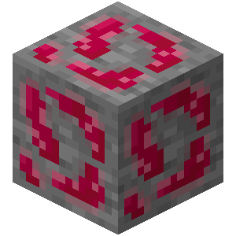
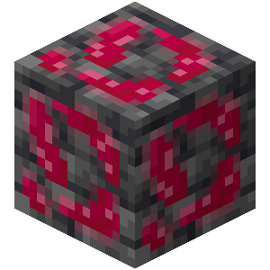
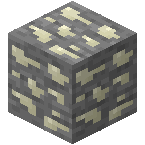
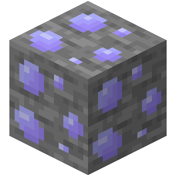
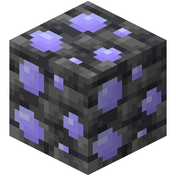

# Ores

Artery adds three types of ore:

| Name      | Ore                                                                                                                                           | Raw                                                          | Ingot                                                            |
| --------- | --------------------------------------------------------------------------------------------------------------------------------------------- | ------------------------------------------------------------ | ---------------------------------------------------------------- |
| Erythrite | {width=100, height=100} {width=100, height=100} | {width=100, height=100}         |                                                                  |
| Thrombium | {width=100, height=100} {width=100, height=100} | {width=100, height=100} | {width=100, height=100} |
| Leukium   | {width=100, height=100}     {width=100, height=100}     | {width=100, height=100}     | {width=100, height=100}     |
