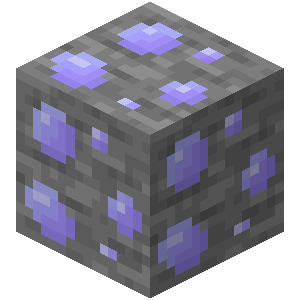
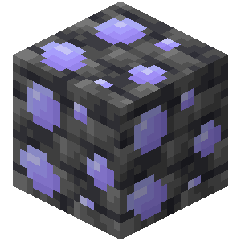

# Leukium

Leukium is a metal used to craft weapons, including armors.

{width=64, height=64}

## Obtaining

### Mining

{width=100, height=100} {width=100, height=100} {width=64, height=64}

Leukium ores can be mined with iron pickaxes or better. Breaking leukium ores drops 1 raw leukium, unless mined with a Silk Touch pickaxe, in which case it drops itself. It is affected by Fortune.

### Smelting

Leukium ingots can be obtained by smelting leukium ores, deepslate leukium ores, or raw leukium.

## Usage

### Crafting

| Ingredients               | Result            |
| ------------------------- | ----------------- |
| Leukium Ingots + 2 Sticks | Leukium Weapons   |
| 9 Leukium Ingots          | Block of Leukium  |

Leukium can only be used to craft swords and axes (axes are considered as weapons here).

## Weapons

Holding any weapon made from leukium reduces [transfusion rate](../sanguinity#transfusion-rate) by 1.5.
