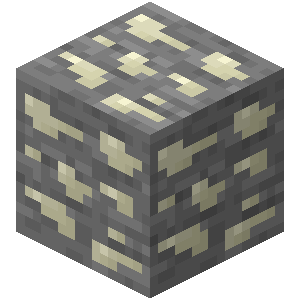
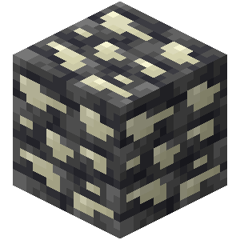

# Thrombium

Thrombium is a metal used to craft various items.

{width=64, height=64}

## Obtaining

### Mining

{width=100, height=100} {width=100, height=100} {width=64, height=64}

Thrombium ores can be mined with iron pickaxes or better. Breaking thrombium ores drops 1 raw thrombium, unless mined with a Silk Touch pickaxe, in which case it drops itself. It is affected by Fortune.

### Smelting

Thrombium ingots can be obtained by smelting thrombium ores, deepslate thrombium ores, or raw thrombium.

## Usage

### Crafting

| Ingredients                              | Result                                         |
| ---------------------------------------- | ---------------------------------------------- |
| Thrombium Ingots                         | Thrombium Armors                               |
| 6 Flesh + 2 Thrombium ingots + 1 Diamond | [Fibroblaster](../organ-block/fibroblaster)    |
| 9 Thrombium                              | Block of Thrombium                             |

## Armors

Each piece of thrombium armor reduces [coagulation rate](../sanguinity#coagulation-rate) by 0.5.
