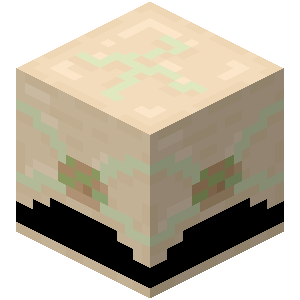

# Fibroblaster

A **fibroblaster** is an organ block that can repair items with sanguinity.

{width=100, height=100}

|                  |             |
| ---------------- | ----------- |
| Capacity         | 40          |
| Tool             | Wooden Hoes |
| Blast resistance | 1.5         |
| Hardness         | 1.5         |

## Obtaining

### Breaking

A fibroblater can be mined using any hoe. If mined without a hoe, it only drops its content.

### Crafting

A fibroblaster can be crafted with 6 [flesh](../misc-items/#flesh), 2 [thrombium ingots](../ores/thrombium) and 1 diamond.

## Usage

### Repairing

Fibroblasters can restore 1 durability at the cost of 2 sanguinity. The repairing process starts slowly but accelerates up to 1 durability per tick.
