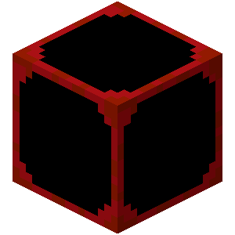

# Organ Block

A **organ block** is a block that forms organ groups and is powered by sanguinity.

::: details List of Blocks

| Block                                                                          | Name         | Capacity |
| :----------------------------------------------------------------------------: | :----------: | :------- |
| [{width=100, height=100}](./atrium)                     | Atrium       | 320      |
| [{width=100, height=100}](./ventricle)            | Ventricle    | 80       |
| [{width=100, height=100}](./fibroblaster)   | Fibroblaster | 40       |
| [{width=100, height=100}](./pressor)                  | Pressor      | 40       |

:::

## Organ Group

Organ blocks in contact with one another forms an **organ group**, members of which share sanguinity and capacity. Sanguinity stored in a group cannot exceed its combined capacity.

Note that players won't gain sanguinity if they break any block in the group or even the entire group. The blocks won't drop sanguinity in any form under any circumstances.
