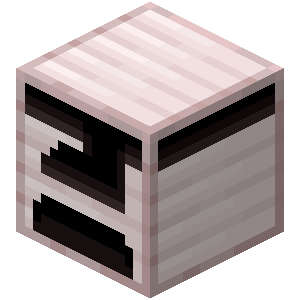

# Pressor

A **pressor** is an organ block used to pressurize items.

{width=100, height=100}

|                  |                         |
| ---------------- | ----------------------- |
| Capacity         | 40                      |
| Tool             | Wooden Hoes or Pickaxes |
| Blast resistance | 1                       |
| Hardness         | 1                       |

## Obtaining

### Breaking

A ventricle can be mined using any hoe or pickaxe. If mined without a proper tool, it only drops its content.

### Crafting

A ventricle can be crafted with 7 [hemoglobium ingots](../misc-items/#hemoglobium-ingots), 1 diamond, and 1 furnace.

## Usage

### Pressurization

Pressors are used to pressurize certian items.

A pressor pressurizes items at the rate of 1 sanguinity per tick.

::: details Pressurizable Items

| Item                        | Max Pressure |
| --------------------------- | ------------ |
| [Totem of Revival](../misc-items/#totem-of-revival)        | 1440         |

:::
