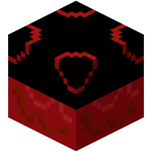

# Ventricle

A **ventricle** is an organ block used to infuse materials.

{width=100, height=100}

|                  |                         |
| ---------------- | ----------------------- |
| Capacity         | 80                      |
| Tool             | Wooden Hoes or Pickaxes |
| Blast resistance | 1.5                     |
| Hardness         | 1.5                     |

## Obtaining

### Breaking

A ventricle can be mined using any hoe or pickaxe. If mined without a proper tool, it only drops its content.

### Crafting

A ventricle can be crafted with 8 [hemoglobium ingots](../misc-items/#hemoglobium-ingot) and 1 dispenser.

## Usage

### Infusion

Ventricles are used to infuse items with sanguinity.

A ventricle infuses items at a constant rate of 1 sanguinity every 5 ticks, but items might cost different amounts to infuse.

::: details All Infusion Recipes

| Input        | Cost | Result                        |
| ------------ | ---- | ----------------------------- |
| Bone         | 10   | Rotten Flesh                  |
| Rotten Flesh | 25   | [Flesh](../misc-items/#flesh) |

:::
